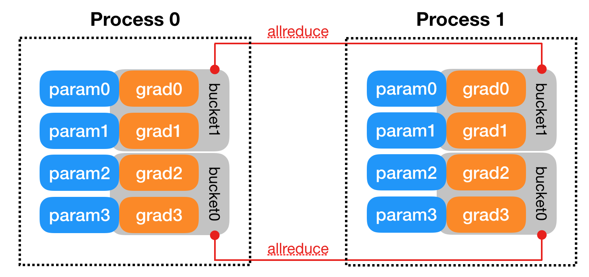

<!--
 * @Author: Kai Zhang
 * @Date: 2022-03-20 15:01:01
 * @LastEditors: Kai Zhang
 * @LastEditTime: 2022-03-23 21:21:54
 * @Description: Tutorial for DDP
-->
# 上手Distributed Data Parallel的详尽教程

## 写在前面
Pyorch中的Distributed Data Parallel（DDP）已经推出很久了，目前自监督和预训练相关的工作都离不开多机并行。但结合本人和身边同学们的情况来看，大家对DDP的用法还都不熟悉，或者觉得没有多机多卡的使用需求。但其实DDP的单机多卡性能也是要优于`DataParallel`的，并且多机多卡是在企业中训练大模型必备的技能。

结合本人学习DDP的过程中，主要的痛点在于：

* Pytorch官方的文档中的知识点比较分散，有时过于简洁。对于缺少并行经验的同学会比较难理解。
* 谷歌/百度到的博客质量参差不齐，大部分都浅尝辄止，很难系统的入门

在走了不少的弯路后，将目前体会到的一些心得记录为本文。希望能够帮助感兴趣的同学少踩一些坑，然后可以更流畅的阅读官方文档（Pytorch官方的文档是很全的）。

由于才疏学浅，文中避免不了会有一些错误或者理解偏差，还请大家批评指正，感谢。
***

## 背景

深度学习的发展证明了大数据和大模型的价值。无论是在CV还是NLP领域，在大规模的计算资源上训练模型的能力变得日益重要。GPU以比CPU更快的矩阵乘法和加法运算，加速了模型训练。但随着数据量和模型参数的增长，单块GPU很快变得不够用。因此我们必须找到合适的方法，实现数据和模型在多个GPU甚至多个计算节点间的划分和复制，从而实现更短的训练周期和更大的模型参数量。

## 数据并行训练

并行训练是解决上述问题的重要方法。`Pytorch`中关于并行训练的内容分为以下三部分：

* **`nn.DataParallel`**
* **`nn.parallel.DistributedDataParallel`**
* `torch.distributed.rpc`

前二者是本文的讨论重点，在CV和NLP中广泛应用。rpc是更通用的分布式并行方案，主要应用在强化学习等领域，不在本文的讨论范围内。`DataParallel`是最容易的并行训练方案，只需要增加一行代码，即可实现模型在多卡上的训练。但在pytorch中，`DataParallel`无论在功能和性能上都不是最优的并行方案，相比于`DistributedDataParallel`（DDP）有诸多不足。

## DataParallel

|  |
|:--:|
| *DataParallel的流程图（图源自[Hugging Face](https://medium.com/huggingface/training-larger-batches-practical-tips-on-1-gpu-multi-gpu-distributed-setups-ec88c3e51255)）* |

`DataParallel`实现并行训练的示意图如上图所示，在的每个前向过程中，模型会由GPU1复制到其它GPUs，这会引入延迟。其次，在每个GPU完成前向运算后，其输出logits会被被收集到GPU-1。logits的收集是`DataParallel`中GPU显存利用不均衡的问题根源。这一现象在图像分类这种logits的维度很小的任务中不明显，但在图像语义分割和文本翻译等密集预测任务中，GPU-1的显存占用会显著高于其它GPU。这会造成额外的GPU资源浪费。

更重要的是，`DataParallel`的并行受`Python`语言中的GIL争用影响，仅能以单进程多线程的方式实现，这并不是理想的并行多进程实现。同时，`DataParallel`最多仅支持单机多卡的训练模式，无法实现需要多台机器训练的大模型。

我们将`DataParallel`的优缺点概括如下：

### 优点

* 只需要一行代码的增加，易于项目原型的开发

```Python
model = nn.DataParallel(model)
```

### 缺点

* 每个前向过程中模型复制引入的延迟
* GPU的利用不均衡
* 单进程多线程的实现
* 不支持多机多卡
  
## DistributedDataParallel

| |
|:--:|
| *DDP的流程图，其中Construction只在训练开始前执行一次，仅Forward和Backward在训练中重复多次* |

DDP的流程示意图如上图所示，DDP需要额外的建立进程组阶段（Construction）。在Construction阶段需要首先明确通信协议和总进程数。通信协议是实现DDP的底层基础，我们在之后单独介绍。总进程数就是指有多少个独立的并行进程，被称为worldsize。根据需求每个进程可以占用一个或多个GPU，但并不推荐多个进程共享一个GPU，这会造成潜在的性能损失。为了便于理解，在本文的所有示例中我们假定每个进程只占用1个GPU，占用多个GPU的情况只需要简单的调整GPU映射关系就好。

并行组建立之后，每个GPU上会独立的构建模型，然后GPU-1中模型的状态会被广播到其它所有进程中以保证所有模型都具有相同的初始状态。值得注意的是Construction只在训练开始前执行，在训练中只会不断迭代前向和后向过程，因此不会带来额外的延迟。

相比于`DataParallel`，DDP的前向后向过程更加简洁。推理、损失函数计算，梯度计算都是并行独立完成的。DDP实现并行训练的核心在于**梯度同步**。梯度在模型间的同步使用的是`allreduce`通信操作，每个GPU会得到完全相同的梯度。如图中后向过程的步骤2，GPU间的通信在梯度计算完成后被触发（hook函数）。图中没有画出的是，通常每个GPU也会建立独立的优化器。由于模型具有同样的初始状态和后续相同的梯度，因此每轮迭代后不同进程间的模型是完全相同的，这保证了DDP的数理一致性。

为了优化性能，DDP中针对`allreduce`操作进行了更深入的设计。梯度的计算过程和进程间的通信过程分别需要消耗一定量的时间。等待模型所有的参数都计算完梯度再进行通信显然不是最优的。如下图所示，DDP中的设计是通过将全部模型参数划分为无数个小的bucket，在bucket级别建立`allreduce`。当所有进程中bucket0的梯度计算完成后就立刻开始通信，此时bucket1中梯度还在计算。这样可以实现计算和通信过程的时间重叠。这种设计能够使得DDP的训练更高效。为了降低阅读难度，关于bucket大小相关的设计细节在此处不赘述了，建议感兴趣的同学之后继续阅读[原论文](https://arxiv.org/pdf/2006.15704.pdf)。

|  |
|:--:|
| *DDP中的模型参数划分为多个bucket的机制示意图（图源自[DDP Note](https://pytorch.org/docs/stable/notes/ddp.html)）* |

在最后我们对DDP的通信部分进行介绍。DDP后端的通信由多种CPP编写的协议支持，不同协议具有不同的通信算子的支持，在开发中可以根据需求选择。

|  |
|:--:|
| *DDP的实现框图（图源自[Paper](https://arxiv.org/pdf/2006.15704.pdf)）* |

对于CV和NLP常用GPU训练的任务而言，选择Gloo或NCCL协议即可。一个决定因素是你使用的计算机集群的网络环境：

* **当使用的是Ethernet（以太网，大部分机器都是这个环境）**：那么优先选择NCCL，具有更好的性能；如果在使用中遇到了NCCL通信的问题，那么就选择Gloo作为备用。（经验：单机多卡直接NCCL；多机多卡先尝试NCCL，如果通信有问题，而且自己解决不了，那就Gloo。）
* **当使用的是InfiniBand**：只支持NCCL。
  
另一个决定性因素是二者支持的算子范围不同，因此在使用时还需要结合代码里的功能来确定。下图记录了每种通信协议能够支持的算子，Gloo能够实现GPU中最基本的DDP训练，而NCCL能够支持更加多样的算子.

|  |
|:--:|
| *不同Backend的算子支持情况（图源自[Doc](https://pytorch.org/docs/stable/distributed.html)）* |

综上，得益于DDP的分布式并行设计，DDP并不受PythonGIL争用的影响，是以多进程的方式运行的。这也使得DDP可以支持多机多卡的训练。我们将DDP的优缺点概括如下：

### 优点

* 更快的训练速度
* 多进程的运行方式
* 支持单机多卡和多机多卡
* 平衡的GPU使用

### 缺点

* 需要更多的代码书写和设计
  
***

## Show Me the Code
本文首先会基于MNIST图像分类建立一个最小原型，然后逐步改进它以实现多机多卡的训练和混合精度的支持。在讲述的思路上本文借鉴了[Kevin Kaichuang Yang的教程](https://yangkky.github.io/2019/07/08/distributed-pytorch-tutorial.html)，但在实现细节上有较大的差异。特别的是本文增加了对DDP启动方式的探讨，并且介绍了多进程通信操作的使用样例。

### 非多进程示例

首先引入了所有用到的库。

```Python
from datetime import datetime
import argparse
import torchvision
import torchvision.transforms as transforms
import torch
import torch.nn as nn
import torch.distributed as dist
from tqdm import tqdm
```

定义一个简单的卷积神经网络模型。

```Python
class ConvNet(nn.Module):
    def __init__(self, num_classes=10):
        super(ConvNet, self).__init__()
        self.layer1 = nn.Sequential(
            nn.Conv2d(1, 16, kernel_size=5, stride=1, padding=2),
            nn.BatchNorm2d(16),
            nn.ReLU(),
            nn.MaxPool2d(kernel_size=2, stride=2))
        self.layer2 = nn.Sequential(
            nn.Conv2d(16, 32, kernel_size=5, stride=1, padding=2),
            nn.BatchNorm2d(32),
            nn.ReLU(),
            nn.MaxPool2d(kernel_size=2, stride=2))
        self.fc = nn.Linear(7*7*32, num_classes)

    def forward(self, x):
        out = self.layer1(x)
        out = self.layer2(out)
        out = out.reshape(out.size(0), -1)
        out = self.fc(out)
        return out
```

定义主函数，添加一些启动脚本的可选参数。

```Python
def main():
    parser = argparse.ArgumentParser()
    parser.add_argument('-g', '--gpuid', default=0, type=int,
                        help="which gpu to use")
    parser.add_argument('-e', '--epochs', default=2, type=int, 
                        metavar='N',
                        help='number of total epochs to run')
    parser.add_argument('-b', '--batch_size', default=4, type=int, 
                        metavar='N',
                        help='number of batchsize')         

    args = parser.parse_args()
    train(args.gpuid, args)
```

然后给出训练函数的详细内容。

```Python
def train(gpu, args):
    model = ConvNet()
    model.cuda(gpu)
    # define loss function (criterion) and optimizer
    criterion = nn.CrossEntropyLoss().to(gpu)
    optimizer = torch.optim.SGD(model.parameters(), 1e-4)

    # Data loading code
    train_dataset = torchvision.datasets.MNIST(root='./data',
                                               train=True,
                                               transform=transforms.ToTensor(),
                                               download=True)
    train_loader = torch.utils.data.DataLoader(dataset=train_dataset,
                                               batch_size=args.batch_size,
                                               shuffle=True,
                                               num_workers=0,
                                               pin_memory=True,
                                               sampler=None)

    start = datetime.now()
    total_step = len(train_loader)
    for epoch in range(args.epochs):
        model.train()
        for i, (images, labels) in enumerate(tqdm(train_loader)):
            images = images.to(gpu)
            labels = labels.to(gpu)
            # Forward pass
            outputs = model(images)
            loss = criterion(outputs, labels)

            # Backward and optimize
            optimizer.zero_grad()
            loss.backward()
            optimizer.step()
            if (i + 1) % 100 == 0:
                print('Epoch [{}/{}], Step [{}/{}], Loss: {:.4f}'.format(epoch + 1, args.epochs, i + 1, total_step,
                                                                   loss.item()))
    print("Training complete in: " + str(datetime.now() - start))
```

最后确保主函数被启动。

```Python
if __name__ == '__main__':
    main()
```

以上是我们的MNIST图像分类最小原型，可以通过如下命令启动在指定单个GPU上的训练：

```Bash
python train.py -g 0
```

### 多进程示例

在开始对最小原型的改造之前，我们还需要交代一些事情。在DDP的代码实现中，最重要的步骤之一就是初始化。所谓初始化对应于上文介绍的Construction阶段，每个进程中需要指明几个关键的参数：

* **backend**：明确后端通信方式，NCCL还是Gloo
* **init_method**：初始化方式，TCP还是Environment variable（Env），可以简单理解为进程获取关键参数的地址和方式
* **world_size**：总的进程数有多少
* **rank**：当前进程是总进程中的第几个

初始化方式不同会影响代码的启动部分。本文会分别给出TCP和ENV模式的样例。

<center>TCP模式</center>

让我们先从TCP开始，注意那些标记被更改的代码部分：

```Python
def main():
    parser = argparse.ArgumentParser()
    parser.add_argument('-g', '--gpuid', default=0, type=int,
                        help="which gpu to use")
    parser.add_argument('-e', '--epochs', default=1, type=int, 
                        metavar='N',
                        help='number of total epochs to run')
    parser.add_argument('-b', '--batch_size', default=4, type=int, 
                        metavar='N',
                        help='number of batchsize')   
    ##################################################################################
    parser.add_argument('--init_method', default='tcp://localhost:18888',            #
                        help="init-method")                                          #
    parser.add_argument('-r', '--rank', default=0, type=int,                         #
                    help='rank of current process')                                  #
    parser.add_argument('--world_size', default=2, type=int,                         #
                        help="world size")                                           #
    parser.add_argument('--use_mix_precision', default=False,                        #
                        action='store_true', help="whether to use mix precision")    #
    ##################################################################################                  
    args = parser.parse_args()
    train(args.gpuid, args)
```

在main函数中需要增加了以下参数：

* args.init_method：url地址，用来指明的初始化方法。在tcp初始化方法中，其格式应为：tcp:[ IP ]:[ Port ] 。IP为rank=0进程所在的机器IP地址，Port为任意一个空闲的端口号。当采用的是单机多卡模式时，IP可以默认为//localhost
* args.rank：当前进程在所有进程中的序号
* args.world_size：进程总数
* args.use_mix_precision：布尔变量，控制是否使用混合精度
  
```Python
def train(gpu, args):
    ########################################    N1    ####################################################################
    dist.init_process_group(backend='nccl', init_method=args.init_method, rank=args.rank, world_size=args.world_size)    #
    ######################################################################################################################
    model = ConvNet()
    model.cuda(gpu)
    # define loss function (criterion) and optimizer
    criterion = nn.CrossEntropyLoss().to(gpu)
    optimizer = torch.optim.SGD(model.parameters(), 1e-4)
    # Wrap the model
    #######################################    N2    ########################
    model = nn.SyncBatchNorm.convert_sync_batchnorm(model)                  #
    model = nn.parallel.DistributedDataParallel(model, device_ids=[gpu])    #
    scaler = GradScaler(enabled=args.use_mix_precision)                   #
    #########################################################################
    # Data loading code
    train_dataset = torchvision.datasets.MNIST(root='./data',
                                               train=True,
                                               transform=transforms.ToTensor(),
                                               download=True)
    ####################################    N3    #######################################
    train_sampler = torch.utils.data.distributed.DistributedSampler(train_dataset)      #
    train_loader = torch.utils.data.DataLoader(dataset=train_dataset,                   #
                                               batch_size=args.batch_size,              #
                                               shuffle=False,                           #
                                               num_workers=0,                           #
                                               pin_memory=True,                         #
                                               sampler=train_sampler)                   #
    #####################################################################################
    start = datetime.now()
    total_step = len(train_loader) # The number changes to orignal_length // args.world_size
    for epoch in range(args.epochs):
        ################    N4    ################
        train_loader.sampler.set_epoch(epoch)    #
        ##########################################
        model.train()
        for i, (images, labels) in enumerate(tqdm(train_loader)):
            images = images.to(gpu)
            labels = labels.to(gpu)
            # Forward pass
            ########################    N5    ################################
            with torch.cuda.amp.autocast(enabled=args.use_mix_precision):    #
                outputs = model(images)                                      #
                loss = criterion(outputs, labels)                            #
            ##################################################################  
            # Backward and optimize
            optimizer.zero_grad()
            ##############    N6    ##########
            scaler.scale(loss).backward()    #
            scaler.step(optimizer)           #
            scaler.update()                  #
            ##################################
            ################    N7    ####################
            if (i + 1) % 100 == 0 and args.rank == 0:    #
            ##############################################   
                print('Epoch [{}/{}], Step [{}/{}], Loss: {:.4f}'.format(epoch + 1, args.epochs, i + 1, total_step,
                                                                   loss.item()))            
    ############    N8    ###########
    dist.destroy_process_group()    #                                       
    if args.rank == 0:              #
    #################################
        print("Training complete in: " + str(datetime.now() - start))
```

在训练函数中增加/修改了以下内容：

* N1：增加了DDP初始化的代码，需要指明backend、init_method、rank和world_size。其含义在前文都有介绍。
* N2：在并行环境下，对于用到BN层的模型需要转换为同步BN层；其次，用`DistributedDataParallel`将模型封装为一个DDP模型，并复制到指定的GPU上。封装时不需要更改模型内部的代码；设置混合精度中的scaler，通过设置`enabled`参数控制是否生效。
* N3：DDP要求定义`distributed.DistributedSampler`，通过封装`train_dataset`实现；在建立`DataLoader`时指定`sampler`。此外还要注意：`shuffle=False`。DDP的数据打乱需要通过设置`sampler`，参考N4。
* N4：在每个epoch开始前打乱数据顺序。（注意total_step已经变为`orignal_length // args.world_size`。）
* N5：利用`torch.cuda.amp.autocast`控制前向过程中是否使用半精度计算。
* N6: 当使用混合精度时，scaler会缩放loss来避免由于精度变化导致梯度为0的情况。
* N7：为了避免log信息的重复打印，可以只允许rank0号进程打印。
* N8: 清理进程；然后，同上。

假设服务器环境为2台服务器（也称为2个node），每台服务器两块GPU。启动方式为：

```bash
# Node 0 : ip 192.168.1.201  port : 12345
# terminal-0
python mnist-tcp.py --init_method tcp://192.168.1.201:12345 -g 0 --rank 0 --world_size 4 --use_mix_precision
# terminal-1
python mnist-tcp.py --init_method tcp://192.168.1.201:12345 -g 1 --rank 1 --world_size 4 --use_mix_precision

# Node 1 : 
# terminal-0
python tcp_init.py --init_method tcp://192.168.1.201:12345 -g 0 --rank 2 --world_size 4 --use_mix_precision
# terminal-1
python tcp_init.py --init_method tcp://192.168.1.201:12345 -g 1 --rank 3 --world_size 4 --use_mix_precision
```
TCP模式启动很好理解，需要在bash中独立的启动每一个进程，并为每个进程分配好其rank序号。缺点是当进程数多的时候启动比较麻烦。完整的脚本文件见[这里](https://github.com/KaiiZhang/DDP-Tutorial)。
***
<center>ENV模式</center>

ENV模式启动会更简洁，对于每个进程并不需要在`dist.init_process_group`中手动的指定其rank、world_size和url。程序会在环境变量中去寻找这些值。代码如下：

```Python
def main():
    parser = argparse.ArgumentParser()
    parser.add_argument('-g', '--gpuid', default=0, type=int,
                        help="which gpu to use")
    parser.add_argument('-e', '--epochs', default=1, type=int, 
                        metavar='N',
                        help='number of total epochs to run')
    parser.add_argument('-b', '--batch_size', default=4, type=int, 
                        metavar='N',
                        help='number of batchsize')   
    ##################################################################################
    parser.add_argument("--local_rank", type=int,                                    #
                        help='rank in current node')                                 #
    parser.add_argument('--use_mix_precision', default=False,                        #
                        action='store_true', help="whether to use mix precision")    #
    ##################################################################################                  
    args = parser.parse_args()
    #################################
    train(args.local_rank, args)    #
    #################################
```

* args.local_rank：这里指的是当前进程在当前机器中的序号，注意和在全部进程中序号的区别。在ENV模式中，这个参数是必须的，由启动脚本自动划分，不需要手动指定。要善用`local_rank`来分配GPU_ID。
* `train(args.local_rank, args)`：一般情况下保持local_rank与进程所用GPU_ID一致。
  
```Python
def train(gpu, args):
    ##################################################################
    dist.init_process_group(backend='nccl', init_method='env://')    #
    args.rank = dist.get_rank()                                      #
    ##################################################################
    model = ConvNet()
    ...
```

* 训练函数中仅需要更改初始化方式即可。在ENV中只需要指定`init_method='env://'`。TCP所需的关键参数模型会从环境变量中自动获取，环境变量可以在程序外部启动时设定，参考启动方式。
* 当前进程的rank值可以通过`dist.get_rank()`得到
* 之后的代码与TCP完全相同

假设服务器环境为2台服务器（也称为2个node），每台服务器两块GPU。ENV模式的启动方式为：

```bash
# Node 0 : ip 192.168.1.201  port : 12345
# terminal-0
python -m torch.distributed.launch --nproc_per_node=2 --nnodes=2 --node_rank=0 --master_addr="192.168.1.201" --master_port=12345 mnist-env.py --use_mix_precision

# Node 1 : 
# terminal-0
python -m torch.distributed.launch --nproc_per_node=2 --nnodes=2 --node_rank=1 --master_addr="192.168.1.201" --master_port=12345 mnist-env.py --use_mix_precision
```

ENV模式可以使用pytorch中的启动脚本`torch.distributed.launch`启动。在启动命令中需要指明多个参数：

* nproc_per_node: 每台机器中运行几个进程
* nnodes：一共使用多少台机器
* node_rank：当前机器的序号
* master_addr：0号机器的IP
* master_port：0号机器的可用端口
  
可以看到无论一台机器中的进程数为多少，只需要一行命令就可以启动，相比于TCP模式启动方式更加简洁。

***

<center>Bonus</center>

参考上文给出的demo，可以用来将已有的训练代码转换为DDP模式。其实现的核心是通过隐藏在`loss.backward()`过程中的`all_reduce`群体通信操作来实现进程组间的梯度同步。为了更深入理解DDP的群体通信，以便于更灵活的自定义一些操作，本文给出一个模型并行验证的实现方式作为样例。

|  |
|:--:|
| *群组通信示意图（图源自[Doc](https://pytorch.org/tutorials/intermediate/dist_tuto.html)）* |

训练中对模型在验证集上进行验证也是必不可少的步骤之一，那么如何在上述demo中增加模型验证的代码呢？如何实现模型的并行验证？

```Python
####################################    N11    ##################################
def evaluate(model, gpu, test_loader, rank):
    model.eval()
    size = torch.tensor(0.).to(gpu)
    correct = torch.tensor(0.).to(gpu)
    with torch.no_grad():
        for i, (images, labels) in enumerate(tqdm(test_loader)):
            images = images.to(gpu)
            labels = labels.to(gpu)
            outputs = model(images)
            size += images.shape[0]
            correct += (outputs.argmax(1) == labels).type(torch.float).sum() 
    dist.reduce(size, 0, op=dist.ReduceOp.SUM) # 群体通信 reduce 操作 change to allreduce if Gloo
    dist.reduce(correct, 0, op=dist.ReduceOp.SUM) # 群体通信 reduce 操作 change to allreduce if Gloo
    if rank==0:
        print('Evaluate accuracy is {:.2f}'.format(correct / size))
 #################################################################################

def train(gpu, args):
    ...
    ####################################    N9    ###################################
    test_dataset = torchvision.datasets.MNIST(root='./data',                        #
                                               train=False,                         #
                                               transform=transforms.ToTensor(),     #
                                               download=True)                       #
    test_sampler = torch.utils.data.distributed.DistributedSampler(test_dataset)    #
    test_loader = torch.utils.data.DataLoader(dataset=test_dataset,                 #
                                               batch_size=args.batch_size,               #
                                               shuffle=False,                       #
                                               num_workers=0,                       #
                                               pin_memory=True,                     #
                                               sampler=test_sampler)                #
    #################################################################################
    start = datetime.now()
    total_step = len(train_loader) # The number changes to orignal_length // args.world_size
    for epoch in range(args.epochs):
        ...
        #####################    N10    #################
        evaluate(model, gpu, test_loader, args.rank)    #
        #################################################
    ...        
```

省略了代码不变的部分，完整的程序见[脚本](https://github.com/KaiiZhang/DDP-Tutorial)。
* N9：增加验证集的DataLoader，设置sampler实现数据的并行切分
* N10：在每个epoch结束前验证模型
* N11: 利用群体通信`Reduce`操作，将计算准确率所需的正确预测数和全局样本数收集到rank0进程中

只需要利用群体通信将验证集样本数和预测正确的样本数汇集在rank0中即可实现并行的模型验证，对于其它任务也可以参考这个思路实现。例如图像语义分割中计算mIoU只需要将每个进程的混淆矩阵汇总相加到rank0即可。

## 一些可能遇到的问题

网络防火墙有可能在首次多机多卡训练时造成计算节点间的通信失败。单机多卡成功运行的代码在扩展至多机多卡遇到问题后可以首先尝试将init_method切换为Gloo，能够回避掉一些潜在的问题。记录一下本人在实践中遇到的问题和解决方法。

### [address family mismatch 错误](https://discuss.pytorch.org/t/runtimeerror-address-family-mismatch-when-use-gloo-backend/64753)

解决方案是手动设置通信的网络端口。机器的网络端口通过`ifconfig`命令查询，有多个网口时可以都尝试一下。

当backend==NCCL

```Bash
# Node 0 
# terminal-0
export NCCL_SOCKET_IFNAME=eth0
python ...

# Node 1 : 
# terminal-0
export NCCL_SOCKET_IFNAME=eth0
python ...
```

当backend==Gloo

```Bash
# Node 0 
# terminal-0
export GLOO_SOCKET_IFNAME=eth0
python ...

# Node 1 : 
# terminal-0
export GLOO_SOCKET_IFNAME=eth0
python ...
```

## 参考
1. https://pytorch.org/docs/stable/distributed.html#choosing-the-network-interface-to-use
2. https://pytorch.org/tutorials/beginner/dist_overview.html
3. Li, S., Zhao, Y., Varma, R., Salpekar, O., Noordhuis, P., Li, T., ... & Chintala, S. (2020). Pytorch distributed: Experiences on accelerating data parallel training. arXiv preprint arXiv:2006.15704.
4. https://zhuanlan.zhihu.com/p/76638962
5. https://yangkky.github.io/2019/07/08/distributed-pytorch-tutorial.html
6. https://medium.com/huggingface/training-larger-batches-practical-tips-on-1-gpu-multi-gpu-distributed-setups-ec88c3e51255